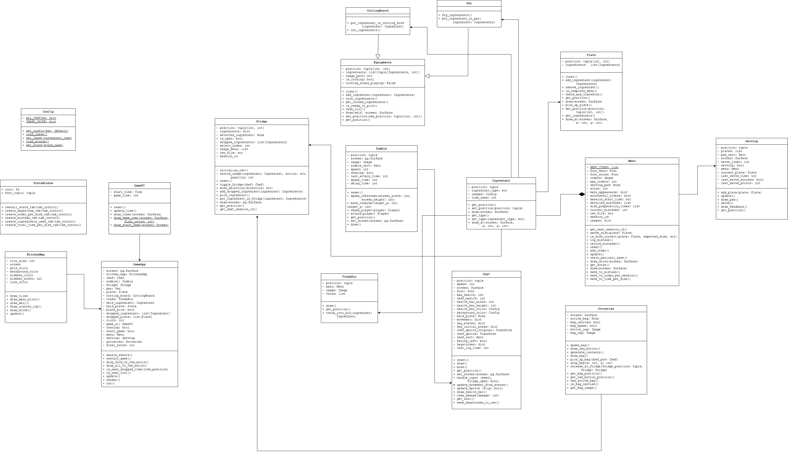

# Description about the Project

## ⏳ Project Overview
Apocalypse Cooker is a cooking game with an apocalypse theme, where the chef opens the restaurant to send food to the 
survivors of a zombie horde in the quarantine zone around the city. The chef, who is a player, must avoid zombies who 
burst into the restaurants as possible while he has to cook food for the survivors.

## 🎮 Game Concept
The purpose of the game is to serve an ordered menu as many dishes as you can to reach the highest score and the game 
will stop when the timer runs out or you are attacked by zombies until your health runs out.

## 🎯 Object-Oriented Programming Implementation
Class Descriptions for Cooking Game:
### GameApp (Main Game Controller)
- Manages the overall gameplay, including game initialization, event handling and game loop execution
- Listens for player input and updates game objects accordingly.
- Handles interactions between the chef, kitchen tools, ingredients and enemies
### Chef (Player Character)
- Represents the player in the game, allowing movement and interaction with kitchen elements
- Can pick up, carry and place ingredients
- Uses kitchen tools (e.g. pan, pot, cutting board) to prepare food.
- Must avoid the zombie while cooking
### Ingredient (Food Items)
- Represents food items that the chef can pick up, cook, or use in recipes.
- The food can be raw, cooked, or chopped, depending on interactions with kitchen tools.
- Can be stored in the fridge or placed on a plate for serving.
### Menu (Customer Orders)
- Displays incoming customer orders dynamically on the side of the screen.
- Orders appear randomly over time, reflecting real-time customer requests.
- Provides a complete menu that players should follow, not random ingredients.
- Updates in real time as new orders arrive and completed dishes are served.
### Zombie (Enemy)
- The main antagonist of the game, constantly chasing the chef and will attack the chef to reduce the chef's health.
- Forces the player to balance cooking and escaping to avoid being caught.
### Equipment (Kitchen Equipment)
- A parent class for various kitchen tools, including Pan and Cutting Board.
- Defines common behaviors for interacting with ingredients.
### Pan (Frying Tool)
- Used for frying ingredients such as meat, eggs, and vegetables.
- Can hold multiple ingredients and cook them over time.
- When cooking is complete, the chef can transfer the food to a plate.
### CuttingBoard (Chopping Tool)
- Used for chopping ingredients before cooking.
- Transforms raw ingredients into their chopped versions.
- Essential for preparing certain dishes that require diced ingredients.
### TrashBin (Disposal Tool)
- Used for disposing of waste materials such as ingredients that players don’t want or the wrong finished order.
### Groceries (Restock food)
- Used for restocking food if it runs out of stock from the fridge.
- Players can request for ingredients by pressing the red button.
- The groceries will be in a paper bag for the player to put it in the fridge.
### Serving (Serving station)
- Used for sending the finished order to the customer
- Acts as the final checkpoint where quality and completeness of orders are verified
- Coordinates with waitstaff or delivery personnel to ensure timely and accurate delivery to customers

## 🧠 Algorithms Involved
- ### Order Generation Algorithm (Queue System)
Randomly generates a customer's menu with different ingredients and complexity such as chicken fried, sandwich or just fried egg.
- ### Ingredients Matching Algorithm
Checks if the player has selected the correct ingredients for a recipe
- ### Timer Algorithm
Tracks how long an ingredient or dish is being cooked and determines if it is perfectly cooked, uncooked, or burnt

## 🧟‍♂️ About the Gameplay
- Ingredients are contained in fridge. Press **E** to open the fridge and add ingredients to the cooking pan by pressing the 
  **Enter key**.
- To drop item, you can press **Shift** on either of both side on your keyboard.
- Wait for the food to be cooked. The cooking time will show on the green bar above the pan.
- Once it's done, you can take the food out of the pan and put it on the plate by pressing **Enter key**
- You can also put the food back in the pan, in the fridge or throw it away.
- The food will be served on the blue pad.
- You can add more ingredients in the fridge by pressing the **Enter key** at the red button and take the paper bag to the fridge.
- When bring the paper bag to the fridge, you can add the ingredients in the bag to the fridge by pressing the **E** key
- The Zombie will chase the player around, you must try to avoid them as much as possible.

## 🧩 UML
The UML diagram below illustrates the main classes and their relationships in the game. 

## Graph Representation
| Feature Name        | Graph Objective                                                | Graph Type   | X-axis                                     | Y-axis            |
|---------------------|----------------------------------------------------------------|--------------|--------------------------------------------|-------------------|
| Total time per dish | Compare cooking efficiency across dishes                     | Boxplot      | Dish Types (sandwich, chicken fried, etc.) | Average Time      |
| Ingredients used    | Show the proportional distribution of ingredients across all dishes | Pie Chart    | Ingredient Names                           | Percentage         |
| Mistakes per order  | Measures how accurately players complete orders               | Bar Graph    | The type of accident the player made       | Mistake Count      |
| Keystrokes per dish | Analyze input efficiency distribution                         | Line Chart   | Keystroke bins                             | Frequency          |
| Orders per session  | Measure engagement vs. session duration                       | Scatter Plot | Session duration (min)                     | Orders Completed   |

## Overview of Data Analysis
The collected data will be analyzed to evaluate players behavior, game difficulty and engagement. The goal is to gain insights into how players interact with the game mechanics, how well the game balances challenges and how to improve the overall experience
Statistical Measures Used
### Descriptive Statistics
Mean, Median, Mode used to analyze average player score, time spent in each level, and zombie encounters per session.
Standard Deviation measures variance in player performance, e.g., if players struggle with specific recipes. 
### Correlation Analysis
Time spent cooking vs. success rate → Do players who take longer perform better?
Zombie encounters vs. failure rate → Are zombies making the game too difficult?
Customer patience vs. dish complexity → Does a harder recipe cause more customers to leave?
### Data Visualization & Presentation
Bar Charts → Display most popular recipes, zombie encounter rates, and common causes of failure.
Line Graphs → Show player progress over time, average time spent per level, and completion rates.
Pie Charts → Represent percentage of orders completed vs. failed, distribution of zombie types, and customer patience levels.

## 📦 GitHub Link
### → [Link](https://github.com/Yatichapat/CookingGame.git)

## 🎬 YouTube Link 
### → [LINK](https://youtu.be/HM9LTVeIe7g)

